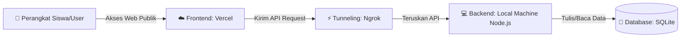

# 🌐 BelajarJaringan: Media Pembelajaran Jaringan Komputer Interaktif (SMP)

[](https://react.dev/)
[](https://nodejs.org/)
[](https://sqlite.org/)
[](https://vercel.com/)
[](https://ngrok.com/)

**BelajarJaringan** adalah aplikasi media pembelajaran interaktif mengenai konsep dasar Jaringan Komputer yang dirancang khusus untuk siswa Sekolah Menengah Pertama (SMP). Aplikasi ini dibuat untuk membantu guru menyajikan materi secara visual, menarik, dan interaktif guna meningkatkan pemahaman belajar siswa.

---

## 🏗️ Arsitektur Sistem & Teknologi

Aplikasi ini menggunakan pendekatan arsitektur **Client-Server** yang dideploy secara terpisah guna memaksimalkan performa dan efisiensi biaya:



* **Frontend (Client)**: Dibangun menggunakan **React 19** + **Vite**, ditata secara premium dengan **Tailwind CSS v4** dan pustaka ikon **Lucide React**. Dihosting secara online di **Vercel**.
* **Backend (Server)**: Menggunakan **Node.js** + **Express.js**, dilengkapi sistem otentikasi aman menggunakan **JSON Web Token (JWT)** dan hashing password **Bcrypt**.
* **Database**: Menggunakan **SQLite** (melalui `sql.js` berkas `.sqlite` lokal) untuk kemudahan portabilitas data nilai siswa.
* **Jembatan Akses (Tunneling)**: Menggunakan **Ngrok** untuk mengekspos server lokal ke internet sehingga database di komputer Anda dapat diakses secara publik dan real-time oleh siswa dari mana saja.

---

## 🔑 Kredensial Uji Coba Default

Untuk kebutuhan pengujian sistem oleh Dosen Penguji, Pembimbing, atau Guru, berikut adalah akun default yang telah terdaftar di database:

| Peran (Role) | Username | Password | Deskripsi Fitur Akses |
|---|---|---|---|
| **Guru (Admin)** | `admin` | `admin123` | Akses penuh ke **Panel Guru** untuk memantau kemajuan materi siswa, melihat riwayat nilai kuis, dan grafik rata-rata kelas. |
| **Siswa** | *(Daftar Bebas)* | *(Bebas)* | Mendaftar secara mandiri melalui tombol **Daftar sekarang** di halaman utama untuk membaca materi dan mengerjakan kuis. |

---

## ⚡ Panduan Menjalankan Sistem (Mode Online Hybrid)

Untuk menjalankan sistem ini agar dapat diakses oleh siswa di kelas atau dosen penguji di tempat lain:

### 1. Jalankan Backend & Tunneling di Laptop Anda
1. Buka folder `backend` di terminal, lalu jalankan server Node.js:
   ```bash
   node src/index.js
   ```
2. Buka aplikasi **Ngrok** di terminal laptop Anda, lalu jalankan terowongan publik pada port `5000`:
   ```bash
   ngrok http 5000
   ```
3. Salin alamat **Forwarding HTTPS** yang diberikan oleh Ngrok (contoh: `https://abcd-1234.ngrok-free.app`).

### 2. Sinkronkan dengan Frontend di Vercel
1. Buka file `frontend/src/api/axios.js` di VS Code Anda.
2. Perbarui nilai `baseURL` dengan alamat link Ngrok yang baru saja Anda salin:
   ```javascript
   const api = axios.create({
     baseURL: 'https://URL_NGROK_BARU_ANDA.ngrok-free.app/api',
   });
   ```
3. Kirim pembaruan kode tersebut ke GitHub agar Vercel melakukan build otomatis:
   ```bash
   git add .
   git commit -m "Update API URL to new Ngrok tunnel"
   git push origin main
   ```
4. Selesai! Web Vercel Anda sudah otomatis terhubung dengan database lokal laptop Anda secara aman.

---

## 🌟 Fitur Utama Aplikasi

1. **6 Pertemuan Materi Terstruktur**:
   * Pertemuan 1: Pengenalan Jaringan Komputer.
   * Pertemuan 2: Sejarah Internet (Dilengkapi ilustrasi garis waktu interaktif).
   * Pertemuan 3: Pengelompokan Geografis (LAN, MAN, WAN) & Topologi Star/Bus.
   * Pertemuan 4: Media Transmisi (Kabel UTP, Fiber Optik, & WiFi).
   * Pertemuan 5: Perangkat Keras Jaringan (Router, Switch, Access Point, dll).
   * Pertemuan 6: Dampak & Manfaat Jaringan (Dilengkapi diagram komparasi visual).
2. **Kuis Interaktif Real-time**: Siswa dapat langsung menguji pemahaman mereka setelah membaca materi dan langsung mendapatkan nilai serta umpan balik instan.
3. **Papan Peringkat (Leaderboard)**: Mengurutkan peringkat siswa berdasarkan perolehan nilai kuis tertinggi demi memotivasi kompetisi belajar sehat.
4. **Panel Pemantauan Guru**: Dashboard visual bagi guru untuk memantau kemajuan belajar siswa secara detail, mempermudah pengambilan nilai tugas harian.
